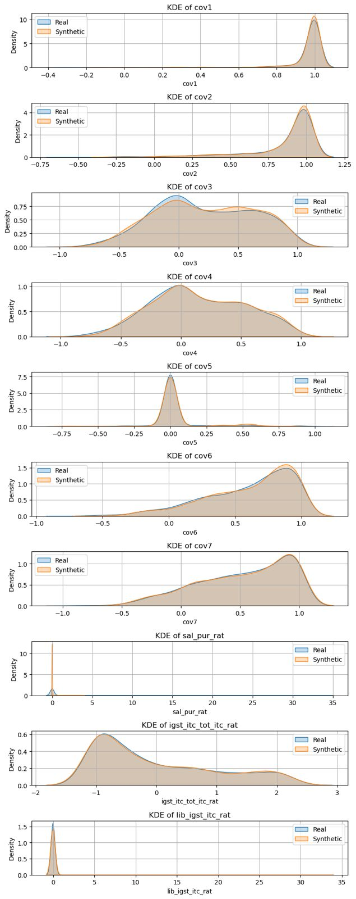
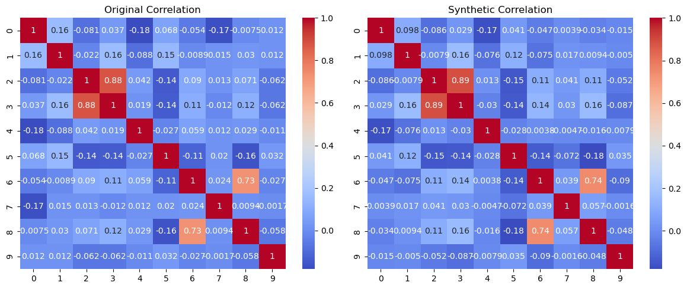

# Copula-WGAN: High-Fidelity Synthetic Tabular Data Generation  

This repository implements **Copula-WGAN**, a framework for generating high-fidelity synthetic **tabular data** using a combination of **Gaussian Copula transformations** and **Wasserstein GAN with Gradient Penalty (WGAN-GP)**.  
The model preserves **feature distributions** and **inter-feature dependencies**, enabling realistic and privacy-preserving data generation for continuous datasets.  

---

## Features  
- **Gaussian Copula Transformation** to map continuous features into a normalized Gaussian space.  
- **WGAN-GP** for stable adversarial training and realistic synthetic data generation.  
- **Preprocessing & Inverse Transformation Pipelines** to reconstruct generated samples back to the original feature space.  
- **Evaluation Metrics** including Kernel Density Estimation (KDE), correlation heatmaps, and distributional comparisons to validate synthetic data quality.  

---

## Installation  
### Clone the repository:  
```bash
git clone https://github.com/yourusername/copula-wgan.git
cd copula-wgan
```

###  Create a virtual environment and install dependencies
```python -m venv venv
source venv/bin/activate   # On Linux/Mac
venv\Scripts\activate      # On Windows

pip install -r requirements.txt
```

---

## Results
### Distribution Comparisons



### Correlation Matrix



---

## Applications

- Privacy-preserving data sharing
- Data augmentation for imbalanced datasets
- Benchmarking ML models on synthetic datasets


